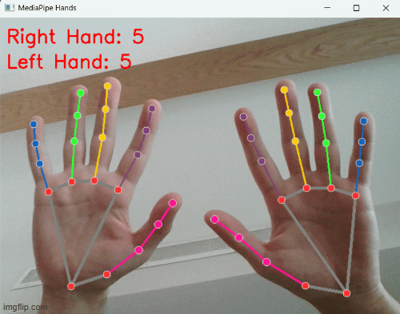

# Finger Counter
A Python project that uses OpenCV and MediaPipe to detect hands via webcam and count the number of fingers shown.

## Features
- Real-time hand tracking using your webcam
- Counts fingers for left and right hands separately
- Displays the count directly on the video feed

## Demo

## Requirements
- Python 3.8+
- OpenCV (opencv-python)
- Mediapipe (mediapipe)

## How it works
Mediapipe detects 21 hand landmarks. When a hand is detected on the webcam, the left or right hand is determined, and the number of open fingers is counted and displayed on the webcam feed.

## Future Improvements
This project can be expanded in many ways. Beyond finger counting, it could recognize gestures like the peace sign or rock-paper-scissors using landmark positions. Another idea is a live calculator that detects hand gestures for addition, subtraction, multiplication, and division to perform calculations in real time.
